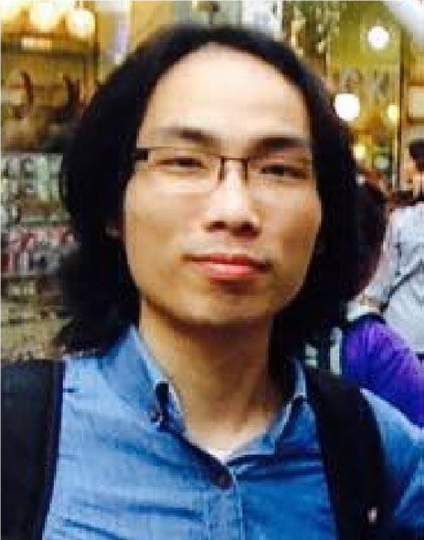

<strong> Byung‑Ryong Lee (CEO) </strong> received the Bachelor’s degree from Busan National University, Busan,
Korea in 1983, and the Master of Engineering degree in Mechanical Engineering from Busan National
University in 1988, and the Ph.D. degree in Mechanical Engineering from North Carolina State
University, NC USA in 1994. From 1988 to 1990, he was a Researcher at RIST(Research Institute of
Science and Technology, Pohang, Korea), and From1994-1995, he was a researcher at KIMM,
Changwon, Korea. Since 1995, he has been with the Intelligent Mechatronics Laboratory of School of
Mechanical Engineering, Ulsan University, Korea, where he is currently a full professor. His research
interests include intelligent control, machine vision and 3D measurement, robotics, and system
diagnosis.

 

<strong> Van‑Phu Do (Director) </strong> received his B.S from Ho Chi Minh City University of Technology, Viet Nam, in 2010. He received
his Ph.D. degree from University of Ulsan, South Korea in 2014. From 2014 to 2015 he was a Researcher at Intellgent
Control &amp; Mechatronics Lab, University of Ulsan, South Korea. He co-founded Abeosystem Co. LTD in 2014. Since
2016, he has been working at Abeosystem as a researcher. His research interests include 3D scanning technology, 3D
geometry processing, 3D pointcloud processing, 3D machine vision for robotics, parallel computing, high performance
image processing and artificial intelligent.