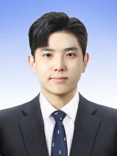
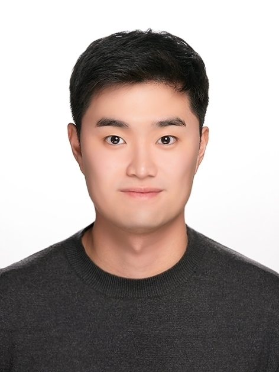
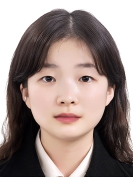

  

<strong> KyeongHwan Lee </strong> is student of university of Ulsan. His major is Mechanical Engineering. He is studying Automatic Driving by using RC car and Raspberry PI. He is developing detecting lane line for his graduation project

 

<strong> Jongkeun Kim </strong> majored in mechanical engineering at Ulsan University and got a certificate of general mechanical engineer. Currently, He is studying Autonomous Lane-Keeping RC car using raspberry pi. 

 

<strong> Gyeongmin Kim </strong> is student of university of Ulsan. Her major is Mechanical Engineering. She is now studying 3D scanning with scanner ABEO AS4500.  

 

<strong> Jaehyeon Park </strong>is student of university of Ulsan. His major is Mechanical Engineering and recently studying RaspberryPi programming for drone and Neural Network. He is developing AI drone for his graduation project.project. 

 