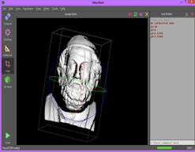
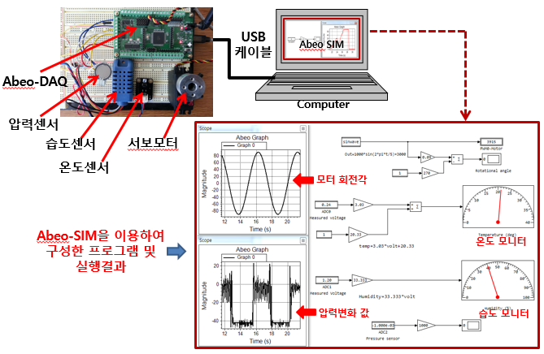
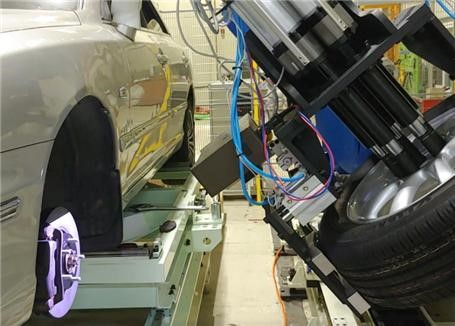
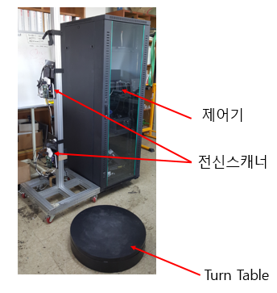
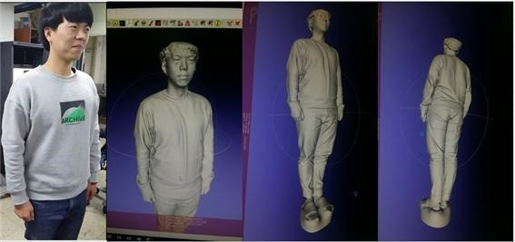

Abeosystem already developed the following systems and softwares:
- Beam projector-type 3D Scanner system and SW development

 

- <strong>Laser-beam-type 3D Scanner system and SW development </strong>

 

- <strong> DAQ board and graphic software development </strong>

 

- <strong>Robot+3D scanning solution softwares for industry Automatic windshield assembly system</strong>

 

- <strong>Automatic windshield assembly system</strong>

 

- <strong>3D inspection system using 3D scanner and robot</strong>

 

- <strong>Development of whole body scanning system</strong>

Test result